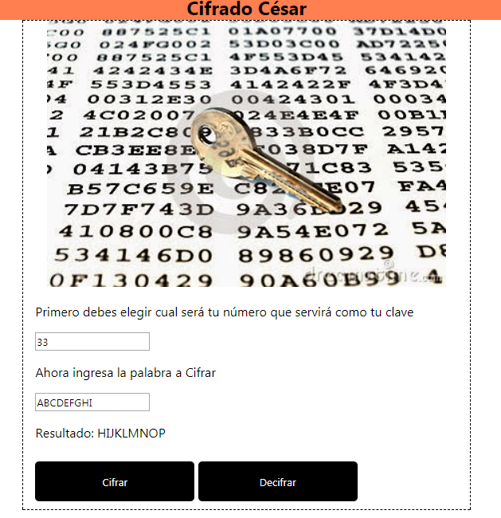

# Proceso Cifrado César con ES6
 
## Descripcion:
Obtener una frase o texto ingresado por el usuario y devuelver el mismo mensaje, pero encriptado según el algoritmo de Cifrado César con la cantidad de desplazamiento a elección del usuario.

_Por ejemplo:_

* Texto original: ABCDEFGHIJKLMNOPQRSTUVWXYZ
* Texto codificado: HIJKLMNOPQRSTUVWXYZABCDEFG

[CLICK AQUI](https://kamalyzl.github.io/cifrado-Cesar/ "gh-pages")

 

_Autora:_ Kamaly Zapana Lorenzo
